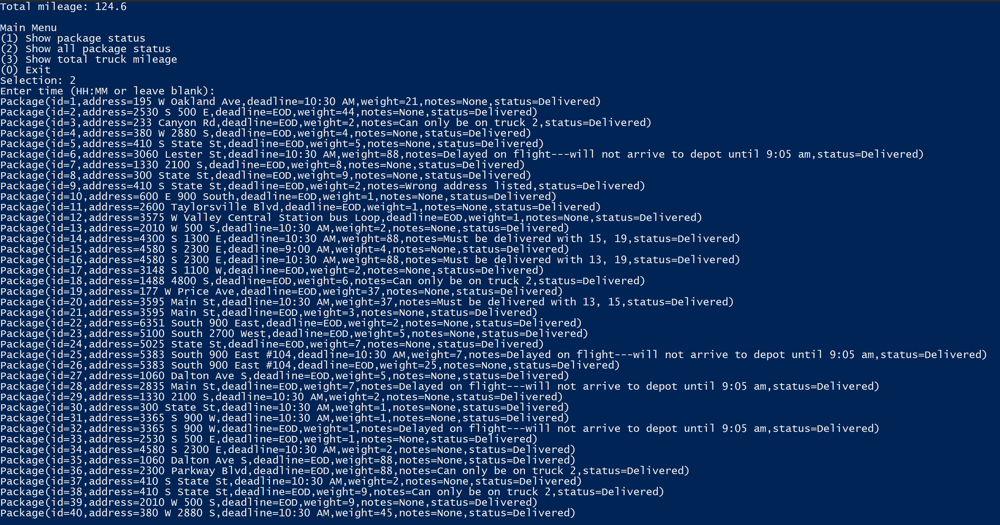

# Algorithm Overview
Author: Andrew Cesar-Metzgus
 
### Requirements
***
#### A: Algorithm Identification
***
The core Package Routing system utilizes a Nearest Neighbor algorithm to solve the routing problem. The packages are 
first sorted and loaded manually. All trucks start at the hub. From there the algorithm will find the closest address
from its current location and deliver <u>all</u> corresponding packages that are currently loaded. This is repeated
until all packages loaded are delivered. After the first two trucks are completed. The system sends the closest truck
back to the hub to pick up the final load and repeats the self-adjusting algorithm to optimize delivery.
***
#### B1: Logic Comments
***
Pseudocode
    
    While still packages in truck:
        Get current lococation
        For package address in address list:
            Get closest address to current location
        Deliver all associated packages to closest address and remove from truck
***
### B2: Development Environment
***
IDE: PyCharm 2021.2.2 (Community Edition)
Python 3.8.2
***
### B3: Space-Time and Big-O
***
Space-Time complexity is commented within the code in the documentation strings.
***
### B4: Scalability and Adaptability
***
The Nearest Neighbor algorithm could easily handle more packages by adding more packages to the csv file. As this method
uses a manual load, the list of package IDs representing a load would need to be added. Finally, another deliver package
method would need to be added to deliver the packages. The code algorithm would not need to be altered at all and can
continue with larger loads and more packages.
  
Further, the Strategy and Model-View-Controller design patters were implemented scalability and adaptability. The abstract, base
class was created with all required attributes and methods that would be needed for future strategy changes. Other types
of algorithms could be easily added and executed simply by inheriting the Strategy abstract class and updating the 
MenuController.
***
### B5: Efficiency and Maintainability
***
The algorithm is extremely efficient. At its core, the nearest neighbor function is only O(n) where n is based solely
on the number of packages remaining per truck. The use of object-oriented programing, list and dictionary comprehension,
and made the most use out of fewer lines code.
  
The algorithm is maintainable based on the design patterns used. The entire program was created with the least amount of
coupling possible. This allows for changes to be made to specific parts of the program without having make the same
changes in other parts of the code. In addition, annotations and comments are written throughout the program for future
programmers.
***
### B6: Self-Adjusting Data Structures
***
Firstly, custom classes and objects have been created to accurately represent and manipulate data as needed. An infinite
number of objects can be created from these. Further, an expandable hash table has been created to store and pass around
package data.
#### Strength
The main strength of the hash table is the efficiency of being able to retrieve objects based on a specified key. This
is much more efficient than having to iterate through (potentially) and entire list.
#### Weakness
The primary weakness is the potential of a collision. Although a collision can be handled by chaining, the more chaining
there is, the less efficient the hash table becomes.
***
### D: Data Structure
***
The data structure used is a hash table. It is self-adjusting and can store the package data.
***
### D1: Explanation of Data Structure
***
The hash table is instantiated with the number of specified keys. Each key holds an empty list to handle collisions.
When inserting data, the hash table requires a key, which can be virtually any data type. The key is than hashed with
python's built-in hash function. The hash that is returned is than mapped to the hash table with modulo [number of keys].
The key is then stored at the 0 index of a list and the value is store at the 1 index of that same list. This list is 
then stored in the list at the key's hash. During a collision, a these key-value pairs are stored within their on list
in the list at the hash.
***
### G1: First Status Check 
***

***
### G2: Second Status Check
***

***
### G3: Third Status Check
***

***
### H: Screen Shots of Code Execution
***

***
### I1: Strengths of the Chosen Algorithm
***
1) Speed and efficiency: The nearest neighbor is able to quickly find the next address by using python's built-in min function.
2) Simplicity: The algorithm can be implemented with as little as 3 lines of code.
***
### I3: Other Possible Algorithms
***
1) Dijkstra
2) Traveling Salesman Problem
***
### I3A: Algorithm Differences
***
Dijkstra explores and optimizes the shortest path from one point to another point by exhausting all points in between.
This method is not as efficient compared to the algorithm chosen for this project because there are many options that 
would need to be exhausted. There are also no restricted options from one point and another point. All points are 
interconnected. In addition, the algorithm chosen did not require a specific end point, but rather focused only on the 
current and next point.
  
Traveling Salesman Problem is extremely inefficient. Eventually, it will find the best path to visit all points but the
solution requires N-factorial. As the number of addresses to visit increases, the more inefficient the solution becomes.
The chosen method does not have an inefficiency issue.
***
### J: Different Approach
***
As a different approach, I would utilize the Strategy design pattern by adding a new strategy implementation. The new
strategy would involve truck loading optimization. There would be a blend of the traveling salesman program and the
nearest neighbor. The traveling salesman portion would break the load into parts based on deadlines and have a targeted 
minimum mileage - rather than an absolute minimum. For instance, if a deadline for a package was 10:30 am and the truck
leaves at 8:00 am, I would set a target path-mileage between 40 and 45. If the algorithm found a path optimized between
those mileages, the algorithm would be satisfied, rather than iterating through all permutations.
***
### K1A: Efficiency
***
By adding more packages, the time needed for the lookup function would be increased by a constant factor. The hash table
can expand by number of packages. Worst case scenario, if the hash table was not expanded, and it had to handle multiple
collisions, it would increase time by factor of n.
***
### K1B: Overhead
***
By adding more packages, the space required by the data structure expands linearly.
***
### K1C: Implications
***
By adding more trucks, the look-up time and space usage of the data structure would not be affected.
***
### K2: Other Data Structures
***
1) Python's Built-in Hash Table: the dictionary. 
2) A list.
***
### K2A: Data Structure Differences
***
1) Python's dictionary, uses a unique hashing system. There are no collisions and is very efficient.
2) A list could be as efficient if the index is slightly adjusted. For instance, if all IDs for products are unique
integers, a method could be used to offset the IDs to map each ID to a unique index of the list.
***
### L: Sources
***
C950 - Webinar-1 - Let's Go Hashing
***
